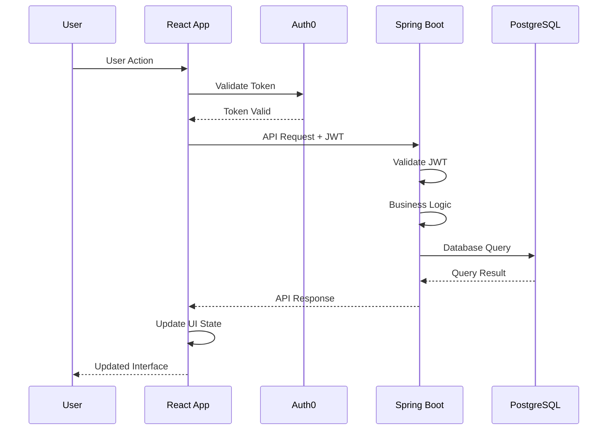
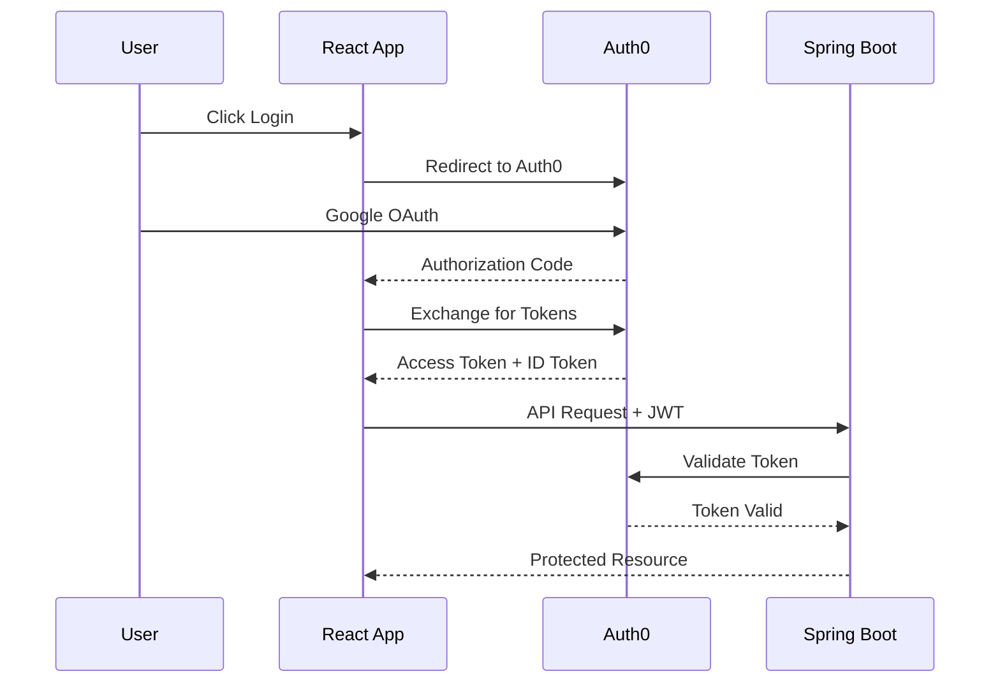
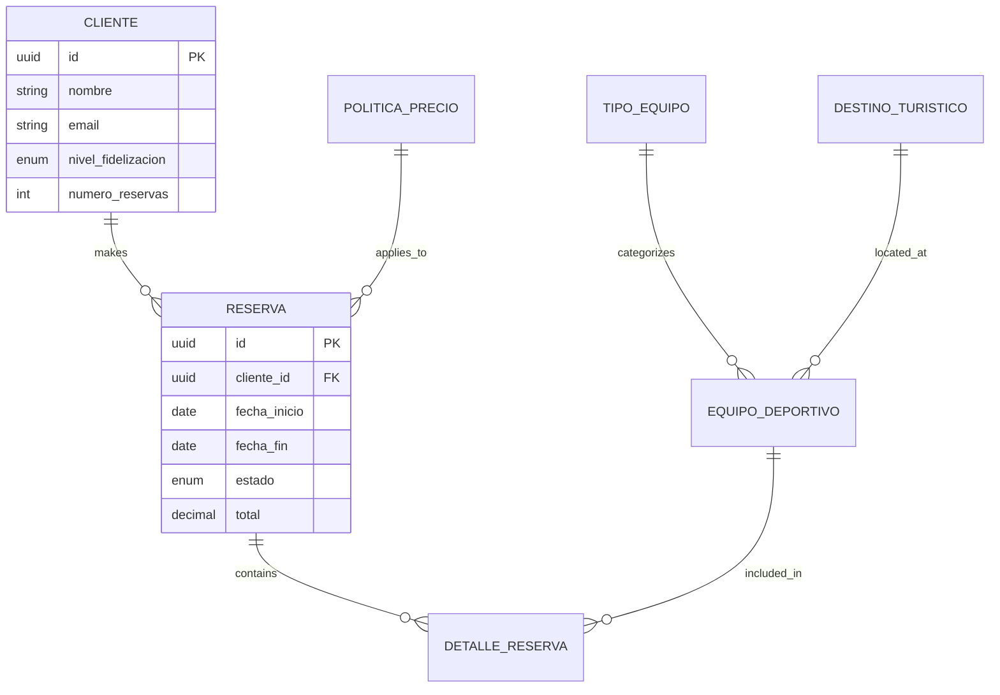

# 🏗️ DeporTur - System Architecture

> **Complete architecture overview for the sports equipment rental management system**

---

## 🎯 Architecture Overview

DeporTur follows a **3-tier architecture** with clear separation of concerns:

```
┌─────────────────┐    ┌─────────────────┐    ┌─────────────────┐
│   Presentation  │    │    Business     │    │      Data       │
│      Tier       │    │      Tier       │    │      Tier       │
│                 │    │                 │    │                 │
│   React SPA     │────│  Spring Boot    │────│   PostgreSQL    │
│ • Components    │    │ • REST APIs     │    │ • Supabase      │
│ • State Mgmt    │    │ • Business Logic│    │ • Migrations    │
│ • Routing       │    │ • Validation    │    │ • Indexes       │
│ • Auth Flow     │    │ • Security      │    │ • Constraints   │
└─────────────────┘    └─────────────────┘    └─────────────────┘
         │                       │                       │
         └───────────────────────┼───────────────────────┘
                                 │
                    ┌─────────────────┐
                    │     Auth0       │
                    │ (Identity Mgmt) │
                    │ • OAuth 2.0     │
                    │ • JWT Tokens    │
                    │ • User Profiles │
                    └─────────────────┘
```

---

## 🛠️ Technology Stack

### **Frontend - React Tier**
| Technology | Version | Purpose |
|------------|---------|---------|
| **React** | 18.2.0 | UI library with hooks |
| **Vite** | 5.0.0 | Build tool and dev server |
| **Tailwind CSS** | 4.1.14 | Utility-first styling |
| **React Router** | 7.9.3 | Client-side routing |
| **TanStack Query** | 5.90.2 | Server state management |
| **React Hook Form** | 7.64.0 | Form handling and validation |
| **Auth0 React SDK** | 2.5.0 | Authentication integration |
| **Axios** | 1.12.2 | HTTP client |
| **Lucide React** | Latest | Icon library |

### **Backend - Spring Boot Tier**
| Technology | Version | Purpose |
|------------|---------|---------|
| **Java** | 17 LTS | Programming language |
| **Spring Boot** | 3.1.4 | Application framework |
| **Spring Security** | 6.x | Security and OAuth2 |
| **Spring Data JPA** | 3.x | Data persistence |
| **Hibernate** | 6.x | ORM implementation |
| **Flyway** | 9.x | Database migrations |
| **Jakarta Validation** | 3.x | Bean validation |
| **Swagger/OpenAPI** | 3.x | API documentation |

### **Database - PostgreSQL Tier**
| Component | Version | Purpose |
|-----------|---------|---------|
| **PostgreSQL** | 15 | Primary database |
| **Supabase** | Latest | Database hosting |
| **Connection Pooling** | PgBouncer | Performance optimization |
| **SSL/TLS** | Enforced | Data encryption |

### **Authentication - Auth0**
| Feature | Implementation | Purpose |
|---------|----------------|---------|
| **OAuth 2.0** | Google provider | Social login |
| **JWT Tokens** | RS256 signed | Stateless authentication |
| **Audience Validation** | API protection | Token scoping |
| **Automatic Refresh** | Silent renewal | Session management |

---

## 🔄 Request Flow

### **Typical API Request Flow**


### **Authentication Flow**


---

## 📁 Code Organization

### **Frontend Structure**
```
deportur-frontend/
├── src/
│   ├── components/          # Reusable UI components
│   │   ├── common/         # Shared components
│   │   ├── clientes/       # Client-specific components
│   │   ├── reservas/       # Reservation components
│   │   └── ui/            # Base UI components
│   ├── pages/             # Page-level components
│   ├── services/          # API service layer
│   ├── hooks/             # Custom React hooks
│   ├── constants/         # Application constants
│   └── App.jsx           # Root component
```

### **Backend Structure**
```
deportur-backend/
├── src/main/java/com/deportur/
│   ├── config/            # Configuration classes
│   ├── controller/        # REST controllers
│   ├── service/           # Business logic
│   ├── repository/        # Data access layer
│   ├── model/            # JPA entities
│   ├── dto/              # Data transfer objects
│   ├── exception/        # Custom exceptions
│   └── util/             # Utility classes
├── src/main/resources/
│   ├── db/migration/     # Flyway migrations
│   └── application.yml   # Configuration
```

---

## 🔒 Security Architecture

### **Authentication & Authorization**
- **OAuth 2.0** with Google as identity provider
- **JWT tokens** with RS256 signature algorithm
- **Audience validation** for API protection
- **Automatic token refresh** for seamless UX

### **API Security**
- **CORS configuration** for cross-origin requests
- **HTTPS enforcement** in production
- **Input validation** on all endpoints
- **SQL injection prevention** via JPA

### **Data Protection**
- **Encrypted database connections** (SSL/TLS)
- **Password hashing** (handled by Auth0)
- **Sensitive data masking** in logs
- **Environment variable protection**

---

## 📊 Data Architecture

### **Core Entities**


### **Business Rules**
- **Equipment availability** - Real-time checking prevents double bookings
- **Dynamic pricing** - Automated discounts based on loyalty, season, duration
- **Inventory tracking** - Maintenance alerts after usage thresholds  
- **Reservation validation** - 12+ business rules ensure data integrity

---

## ⚡ Performance Considerations

### **Frontend Optimization**
- **Code splitting** with React.lazy and Suspense
- **Caching strategy** with TanStack Query
- **Bundle optimization** with Vite tree-shaking
- **Image optimization** with lazy loading

### **Backend Optimization**
- **Connection pooling** for database efficiency
- **JPA query optimization** with proper indexing
- **Caching layer** for frequently accessed data
- **Pagination** for large result sets

### **Database Optimization**
- **Proper indexing** on foreign keys and search columns
- **Query optimization** with explain plans
- **Connection limits** and timeout configuration
- **Backup and recovery** strategies

---

## 🚀 Scalability Strategy

### **Horizontal Scaling**
- **Stateless backend** enables multiple instances
- **Database connection pooling** handles concurrent requests
- **CDN deployment** for frontend assets
- **Load balancing** for high availability

### **Vertical Scaling**
- **Resource monitoring** for bottleneck identification
- **Database performance tuning** 
- **Memory optimization** in JVM configuration
- **Caching strategies** to reduce database load

---

## 🏗️ Design Patterns

### **Backend Patterns**
- **Repository Pattern** - Data access abstraction
- **Service Layer Pattern** - Business logic separation
- **DTO Pattern** - API contract definition
- **Builder Pattern** - Complex object creation
- **Strategy Pattern** - Dynamic pricing calculations

### **Frontend Patterns**
- **Component Composition** - Reusable UI building blocks
- **Custom Hooks** - Logic reuse and separation
- **Provider Pattern** - Global state management
- **Compound Components** - Complex UI composition
- **Error Boundaries** - Graceful error handling

---

## 📈 Monitoring & Observability

### **Application Monitoring**
- **Health check endpoints** for system status
- **Structured logging** with correlation IDs
- **Error tracking** and alerting
- **Performance metrics** collection

### **Database Monitoring**
- **Query performance** tracking
- **Connection pool** monitoring
- **Slow query** identification
- **Resource utilization** alerts

---

*This architecture supports the current feature set while remaining flexible for future enhancements and scaling requirements.*