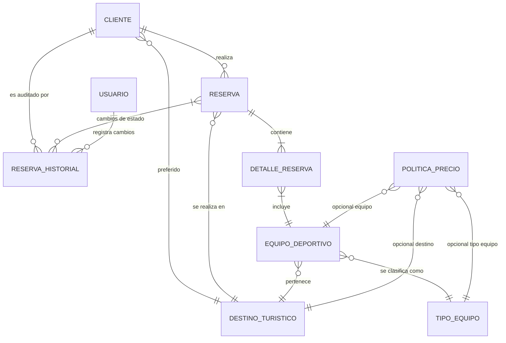

## Relaciones principales
- **cliente** 1 ── * **reserva**
  - Cada cliente puede generar múltiples reservas.
  - Columnas: `reserva.id_cliente` → `cliente.id_cliente`.
- **reserva** 1 ── * **detalle_reserva**
  - Detalla cada equipo incluido en la reserva.
  - `detalle_reserva.id_reserva` → `reserva.id_reserva`.
- **equipo_deportivo** 1 ── * **detalle_reserva**
  - Indica qué equipos fueron alquilados.
  - `detalle_reserva.id_equipo` → `equipo_deportivo.id_equipo`.
- **destino_turistico** 1 ── * **equipo_deportivo** y 1 ── * **reserva**
  - Conecta el destino con los equipos que se pueden alquilar y con las reservas asociadas.
- **tipo_equipo** 1 ── * **equipo_deportivo**
  - Clasifica los equipos.
- **reserva** 1 ── * **reserva_historial**
  - Guarda la secuencia de estados de cada reserva.
- **politica_precio**
  - Relaciones opcionales con `destino_turistico`, `tipo_equipo`, `equipo_deportivo`.
  - Permite políticas globales o específicas.
- **cliente** * ── 1 **destino_turistico** (preferido)
  - Campo opcional `destino_preferido_id`.

## Diagrama textual simplificado
```
cliente ──< reserva ──< detalle_reserva >── equipo_deportivo >── tipo_equipo
    │             │                                 │
    │             └──< reserva_historial            └──< politica_precio
    │
    └── destino_preferido (opcional)

destino_turistico ──< equipo_deportivo
destino_turistico ──< reserva
destino_turistico ──< politica_precio
```

## Consideraciones de integridad
- **Estados**: `reserva.estado` y `equipo.estado` dependen de enumeraciones definidas en el código.
- **Montos**: `subtotal`, `descuentos`, `recargos`, `impuestos`, `total` usan `DECIMAL(10,2)` y deben permanecer sincronizados con la lógica de cálculo del backend.
- **Capacidad**: `destino_turistico.capacidad_maxima` permite validar, desde el backend, la cantidad máxima de equipos/reservas simultáneas.

## Claves y restricciones
- Claves primarias con `IDENTITY`.
- Claves foráneas con `ON DELETE RESTRICT` implícito (verificar en la implementación real de la base).
- `cliente.documento` es `UNIQUE`.
- Otras restricciones (como `NOT NULL`) replican las validaciones básicas asignadas en las entidades JPA.

## Próximos pasos
- Generar un diagrama ERD formal (Herramientas sugeridas: DrawSQL, dbdiagram.io, PlantUML) y enlazarlo a este documento.
- Cuando se configuren migraciones, documentar aquí cualquier índice adicional o constraint específico.

## Diagrama entidad-relación (ER)

